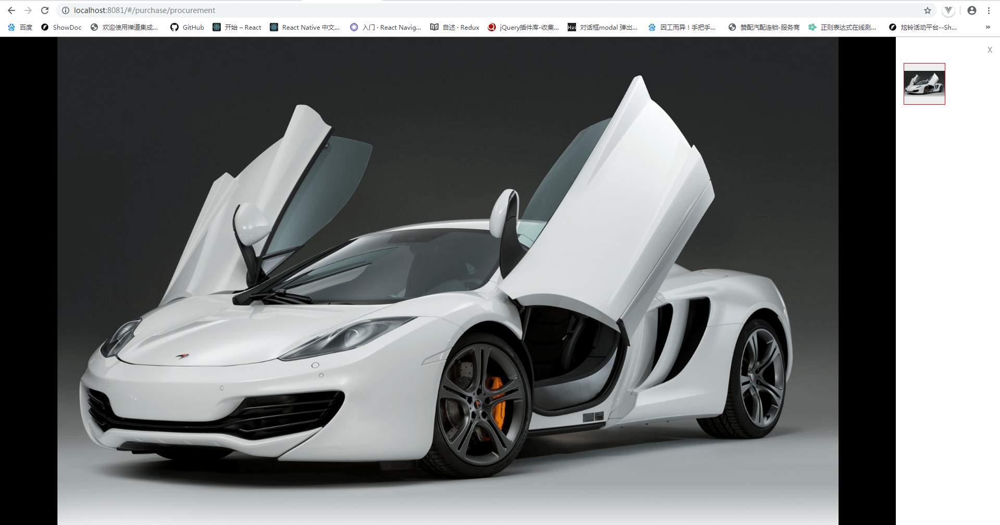
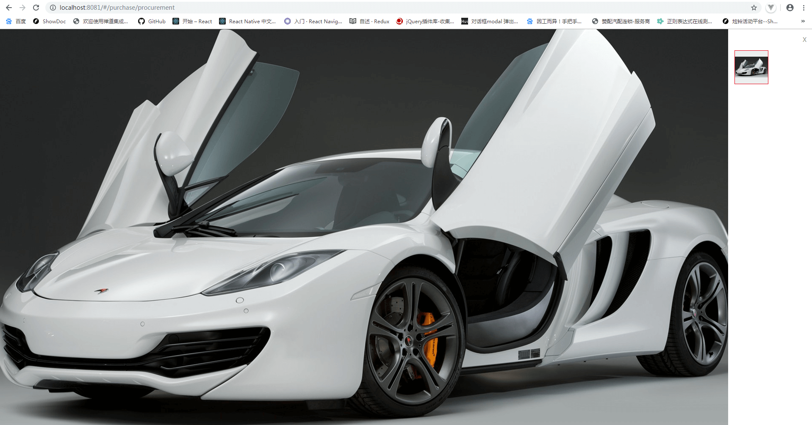
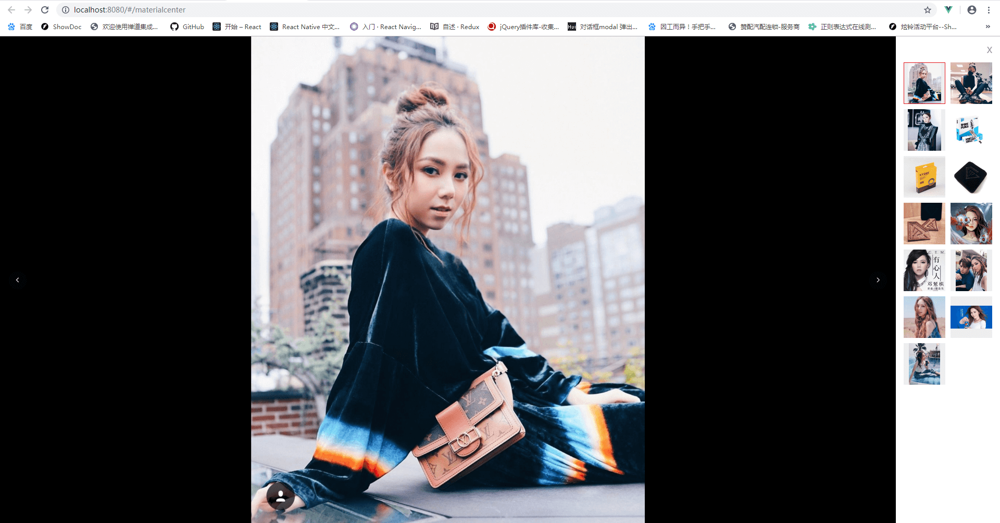

# vue-preview-photos
一个基于Element的el-carousel预览图片的二次封装组件，有显示略缩图、可单张、多张预览，拖拽、放大等功能<br/>
因为项目需要使用到点击略缩图预览的功能，找了一下vue的图片预览组件，没有达到项目的需求，所以自己封装了一个预览的组件，因为项目使用的是element-ui,所以借助了\<el-carousel>来实现轮播切换的效果。<br/>
## 效果展示
* 单张预览   
  给图片绑定打开预览组件的事件方法，预览的图片将切换到高清原图的路径，如果图片超出窗口尺寸，默认是cover效果（既自动覆盖到浏览器全屏显示），鼠标光标显示可放大图标，单击图片显示图片原尺寸，此时可拖拽移动图片，但不会超出图片本身大小（做了限定）。      
      
  点击后效果，样式可以修改，可拖拽（鼠标样式截不到图）
  
* 多张预览    
  基本的跟单张一样，多了个左右切换按钮，使用el-carousel轮播切换，点击右侧略缩图也会切换到对应大图。（嘿嘿）   
  

## 使用方法：
* 首先引入element-ui，因为使用了element组件<br/>
* 下载previewPhoto.vue文件（可以直接copy代码），放入components文件夹下，在需要使用的组件内引入：<br/>
  ```javascript
  import PreviewPhoto from "@/components/previewphoto"
  ```
  注册组件：
  ```javascript
  export default {
    components: { PreviewPhoto },
    data() {
      retrun { 
        previewPictureArray: []  // 包含略缩图路径和原图路径的对象数组
        /**
        * 数组的要求格式为：
        * [
        *   {
        *     fullThumbnailPath: 'http://cdn.duitang.com/uploads/item/201501.png',
        *     fullPath: 'http://cdn.duitang.com/uploads/item/201501.thumb.png'
        *   },
        *   ...
        * ]
        */
      }
    }
    // ...
  }
  ```
  HTML:
  ```html
  <template>
  <div class="container">
    <ul>
      <li v-for="(item, i) in previewPictureArray" :key="i">
        
      </li>
    </ul>
    <!-- 图片预览组件 -->
    <preview-photo ref="preview" :previewPictureArray="previewPictureArray"></preview-photo>
  </div>
  </template>
  ```
  方法调用：
  ```javascript
  // 打开预览组件并设置选中图片（默认为第一个）
  this.$refs.preview.handleSetActiveItem(index);
  ```
关于封装还有很多要学的，有很多不足还需要去改进... 